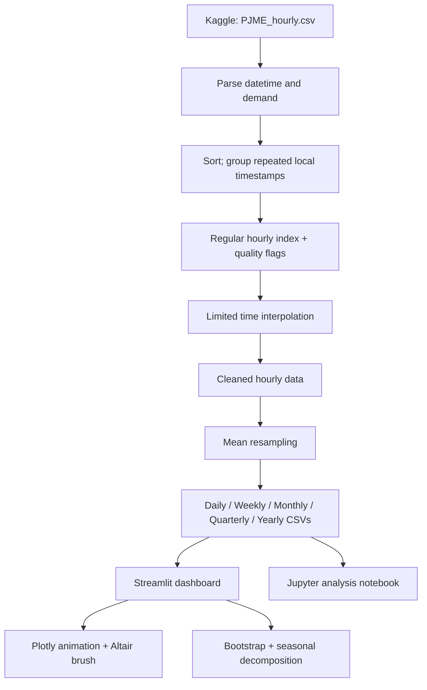

<div align="center">

# ⚡ PJM Energy Trends & Seasonality

### What changes when we change the way we show time?

**An interactive exploration of historical PJM East electricity demand, 2002–2018**  
*DATS 6401 · Visualization of Complex Data · George Washington University*

[](https://pjm-energy-trends-and-seasonality.streamlit.app/)
[](notebooks/01_time_series_analysis.ipynb)
[](app.py)

<br>


**[🚀 Open the dashboard](https://pjm-energy-trends-and-seasonality.streamlit.app/) · [📓 Open the analysis notebook](notebooks/01_time_series_analysis.ipynb) · [🧭 How to use the app](#explore-the-dashboard)**

</div>

---

## The question

A single electricity-demand record can tell very different visual stories. Hourly and daily views expose short-lived changes; monthly views show the recurring seasonal cycle; a 12-month rolling mean brings slower movement into focus. A shaded ribbon may describe **observed variability** or **uncertainty in an estimated mean**—and those are not interchangeable.

This project makes those choices visible and interactive rather than hiding them behind a finished chart.

| Project at a glance | |
|:--|:--|
| **Location / series** | PJM East (`PJME`) |
| **Variable** | Electricity demand, measured in **megawatts (MW)** |
| **Original data** | Hourly observations, 2002–2018 |
| **Main statistical sample** | **198 complete interior months**, February 2002–July 2018 |
| **Complete-year seasonal comparison** | 2003–2017 |
| **Application** | Streamlit + Plotly + Altair + Matplotlib |
| **Supporting analysis** | pandas, NumPy, statsmodels; executable Jupyter notebook |

> **MW ≠ MWh.** MW expresses power/demand. The app uses **mean** when resampling demand; it does not label a sum of MW readings as energy consumed.

## Explore the dashboard

**[Launch the live application →](https://pjm-energy-trends-and-seasonality.streamlit.app/)**

In the left sidebar, choose **Choose a visualization**. The application currently provides seven views:

| View | What you can do | Main idea |
|:--|:--|:--|
| **1 · Smooth rolling-window motion** | Play, pause, scrub the timeline; adjust resolution, window and speed | See exactly how smoothing changes the visible story |
| **2 · Seasonal pattern by year** | Play or scrub complete calendar years, 2003–2017 | Watch annual seasonal patterns change between years |
| **3 · Progressive time-series reveal** | Play or scrub the monthly record | Watch observed demand and a 12-month trend emerge |
| **4 · Manual Streamlit-loop demo** | Play a frame-by-frame animation | Compare server-side redraws with Plotly's in-browser frames |
| **5 · Uncertainty & bootstrap CIs** | Switch among three explanatory tabs; adjust resample count | Separate data spread from uncertainty in historical means |
| **6 · Additive vs multiplicative decomposition** | Compare component plots and residuals | Ask whether seasonality is better expressed in MW or proportional factors |
| **7 · Altair interactive date-range brush** | Drag across the lower overview chart; inspect the upper detail | Zoom analytically without changing the source observations |

<details>
<summary><strong>▶ A quick guided tour (about two minutes)</strong></summary>

1. Select **1 · Smooth rolling-window motion**, then choose **Monthly** and a **12-period** window. Press **Play**. The shaded window moves as the rolling mean is revealed.
2. Compare **3**, **12**, and **60** periods. Notice which peaks persist and which shorter changes disappear.
3. Select **2 · Seasonal pattern by year**. Move the year slider to compare summer and winter demand shapes.
4. Select **5 · Uncertainty & bootstrap confidence intervals** and compare the **95% CI band** with the **±2 SD spread**. Read each caption before interpreting a ribbon.
5. Select **6 · Additive vs multiplicative decomposition** and inspect the residual tab.
6. Select **7 · Altair interactive date-range brush**, then **drag on the bottom overview** to change the upper detail chart. Clear the selection to restore the full range.

**Control note:** views **1, 4 and 7** use the chosen Daily / Weekly / Monthly / Quarterly / Yearly resolution. Views **2, 3, 5 and 6** deliberately use monthly data for annual-seasonality and statistical comparisons.

</details>

<details>
<summary><strong>▶ How to read the animated rolling-window chart</strong></summary>

- **Faint line:** observed average demand at the selected resolution.
- **Orange line:** mean over the specified trailing window.
- **Shaded window:** observations contributing to the current smoothed value.
- **Moving point:** most recent value on the revealed rolling mean.
- **Fixed axes:** the chart does not change its scale as the animation progresses.

A **3-month** window follows seasonal changes more closely; **12 months** spans one annual cycle; **60 months** makes a five-year moving summary but can flatten turning points. A longer window is not automatically a more accurate depiction—it answers a different question.

</details>

## Visual methods and statistical interpretation

### 01 · Trend and seasonality

The companion [notebook](notebooks/01_time_series_analysis.ipynb) includes a monthly trend comparison, the autocorrelation function (ACF) of **differenced** monthly demand, 3/12/60-month rolling means, a month-of-year profile, and additive/multiplicative decomposition. A **12-month period** represents the annual cycle in the monthly series.

### 02 · Uncertainty: three different questions

| Chart | What it estimates or describes | What it does **not** mean |
|:--|:--|:--|
| **Year-bootstrap 95% CI by calendar month** | Uncertainty in each historical calendar-month mean, resampling **whole complete years** | A forecast, or a 95% interval for an individual month |
| **12-month mean ±2 sample SD** | Descriptive spread of observations within each trailing window | A 95% confidence interval for the mean |
| **Moving-block bootstrap 95% CI** | Approximate uncertainty in the **overall historical monthly mean**, using 12-month circular blocks | A range for future electricity demand |

The year bootstrap uses **2003–2017**; the overall-mean bootstrap and rolling-spread analysis use the **198 interior months**. The bootstrap is reproducible using a fixed random seed. Resampling helps quantify sampling variability, but long-run trend and dependence across years limit simple confidence-interval interpretations. See [`src/analysis.py`](src/analysis.py) for the calculation details.

<details>
<summary><strong>▶ Why the distinction between ±2 SD and a confidence interval matters</strong></summary>

A wide **±2 SD** band can signal substantial *month-to-month variation*, even when an average is relatively well estimated. A **bootstrap CI** instead quantifies variation in an *estimated historical mean under its resampling assumptions*. Their widths and meanings differ. Neither should silently be advertised as a prediction interval.

</details>

### 03 · Decomposition: two representations of the same series

| Model | Representation | Seasonal component |
|:--|:--|:--|
| **Additive** | Observed = Trend + Seasonal + Residual | Expressed in **MW** |
| **Multiplicative** | Observed = Trend × Seasonal × Residual | Expressed as a **factor** |

Both use the same interior monthly sample and a **12-month season**. The dashboard also displays residuals on a more comparable percent-style scale. Residual structure—and whether seasonal amplitude changes with the series level—is more informative than comparing raw residual magnitudes measured in different units.

### 04 · Date-range brushing

The **Altair** view links an overview to a detail chart. Dragging across the *bottom* overview selects a time interval; the top chart filters to that interval. The full-series rolling mean is **not recomputed** after brushing: only the displayed range changes.

## From the source data to the app



The original dataset is [**Hourly Energy Consumption** on Kaggle](https://www.kaggle.com/datasets/robikscube/hourly-energy-consumption), published by **robikscube** and attributed there to PJM Interconnection. This project focuses on the `PJME_hourly.csv` subset.

The preprocessing script [**`src/prepare_data.py`**](src/prepare_data.py):

- Parses `Datetime` and `PJME_MW`, removes unusable rows and sorts by time.
- Averages duplicated *naive local clock timestamps*, retaining duplicate-count indicators. The source does not supply offsets sufficient to reconstruct separate UTC instants for repeated local times.
- Reindexes to a regular hourly timeline, identifies gaps and applies **time-based interpolation with `limit=1`**; this does **not** guarantee that longer missing runs are filled.
- Saves a cleaned hourly CSV and **mean** aggregates at five coarser resolutions.

<details>
<summary><strong>▶ Explore the repository structure</strong></summary>

```text
PJM-Energy-Trends-and-Seasonality/
├── app.py                           # Streamlit dashboard and seven views
├── README.md                        # This guide
├── DEPLOY.md                        # Deployment notes
├── requirements.txt                 # App runtime dependencies
├── data/
│   ├── raw/
│   │   └── PJME_hourly.csv
│   └── processed/
│       ├── PJME_hourly_clean.csv
│       ├── PJME_daily.csv
│       ├── PJME_weekly.csv
│       ├── PJME_monthly.csv
│       ├── PJME_quarterly.csv
│       └── PJME_yearly.csv
├── notebooks/
│   └── 01_time_series_analysis.ipynb
└── src/
    ├── __init__.py
    ├── prepare_data.py
    └── analysis.py
```

</details>

## Reproduce locally

```bash
git clone https://github.com/nazishatta/PJM-Energy-Trends-and-Seasonality.git
cd PJM-Energy-Trends-and-Seasonality

# Use Python 3.13, matching the recorded development environment.
python3.13 -m venv .venv
source .venv/bin/activate          # macOS / Linux
python -m pip install -r requirements.txt
python -m streamlit run app.py
```

Windows PowerShell activation: `.venv\Scripts\Activate.ps1`. If Python is installed as `py`, create the environment with `py -3.13 -m venv .venv`.

Open **http://localhost:8501**. The app loads the committed `data/processed/` CSVs using paths relative to `app.py`; it does not need Kaggle API credentials or a separate data server.

<details>
<summary><strong>▶ Optional: regenerate the processed CSVs or open the notebook</strong></summary>

From the repository root, with your environment active:

```bash
# Regenerate the processed datasets from data/raw/PJME_hourly.csv
python src/prepare_data.py

# The runtime requirements intentionally do not install JupyterLab.
python -m pip install jupyterlab
jupyter lab notebooks/01_time_series_analysis.ipynb
```

The repository's notebook contains executed outputs. Re-run cells if you want to reproduce the numerical results locally.

</details>

<details>
<summary><strong>▶ Deployment and common troubleshooting</strong></summary>

The public app is hosted on **Streamlit Community Cloud** at [pjm-energy-trends-and-seasonality.streamlit.app](https://pjm-energy-trends-and-seasonality.streamlit.app/). Configuration: GitHub repo `nazishatta/PJM-Energy-Trends-and-Seasonality`, branch `main`, entry point `app.py`.

- `ModuleNotFoundError: No module named 'src.analysis'` → confirm [`src/analysis.py`](src/analysis.py) and [`src/__init__.py`](src/__init__.py) are committed, then redeploy.
- A missing CSV error → check that all files under `data/processed/` were pushed to GitHub and retain their exact names.
- Environment confusion on the original Mac setup → the historical course virtual environment lived at `HW_4/.venv`, **one level above** this repo. On a fresh clone, use the self-contained `.venv` instructions above instead.
- See [**DEPLOY.md**](DEPLOY.md) for project-specific upgrade and deployment instructions.

</details>

## Visualization integrity & limitations

- **Temporal resolution is disclosed**; a daily pattern should not be interpreted as a monthly observation.
- **Axes are fixed within animations** so playback does not create apparent changes by rescaling. Line-chart axes need not start at zero, but must show MW units and a readable scale.
- **Smoothing windows are labeled**; a 60-month trend deliberately suppresses more variation than a 3-month trend.
- **Incomplete boundary months are excluded** from the primary monthly statistical sample; year-by-year comparisons use complete years.
- **Spread, confidence intervals and forecasts are different quantities.** This project performs *historical exploratory analysis*, not causal inference or demand forecasting.
- **Local timestamps and imputation remain methodological limitations.** Grouping a repeated local timestamp is a practical choice, not a reconstruction of the original UTC timeline.

## Author · attribution

**Nazish Atta** · MS Data Science, **George Washington University**  
Course project: **DATS 6401 — Visualization of Complex Data**

- [GitHub profile](https://github.com/nazishatta)
- [Live project](https://pjm-energy-trends-and-seasonality.streamlit.app/)
- [Dataset citation: Kaggle / robikscube](https://www.kaggle.com/datasets/robikscube/hourly-energy-consumption)

This repository documents an educational visualization project. Dataset redistribution and use remain subject to the source dataset's applicable terms.

---

<div align="center">

**Explore the data, change the lens, and watch the story change.**

[](https://pjm-energy-trends-and-seasonality.streamlit.app/)

</div>
